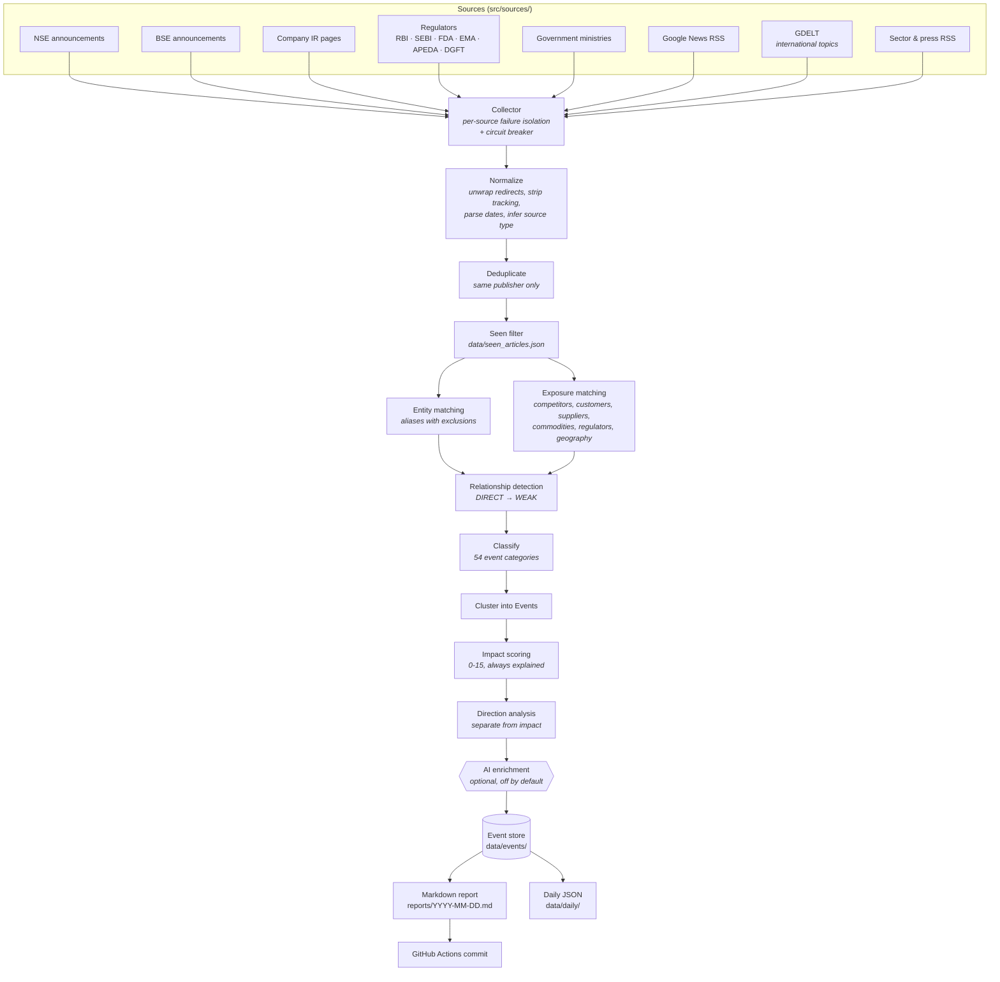

# Architecture

## The one design decision that shapes everything

**The primary object is the Event, not the Article.**

A Reuters story, an Economic Times write-up, an NSE filing and the company's
own press release about a single export order are one Event with four sources
— not four intelligence items. Everything downstream follows from that: impact
is scored per Event, per stock; the number of *independent* sources is a
scoring signal; an Event can be updated for weeks as a story develops.

An Event carries one `StockImpact` record per affected company, because the
same development points in different directions for different holdings.
"Module prices collapse" is negative for a module maker and would be positive
for a project developer.

## The pipeline



Every stage has a narrow interface, so any one of them can be replaced without
touching the others. The three seams that matter most:

- **the source registry** (`src/sources/__init__.py`) — add a source, change
  nothing downstream;
- **the `Classifier` protocol** (`src/classify.py`) — swap rules for an LLM,
  change nothing upstream;
- **the `AiProvider` protocol** (`src/ai/base.py`) — swap models freely; the
  deterministic pipeline is complete without any of them.

## Modules

| Module | Responsibility |
| --- | --- |
| `src/models.py` | The domain: `Article`, `Event`, `StockImpact`, `ExposureMatch`, `PriceReaction`, and every enumeration. Serialisation lives with the model. |
| `src/config.py` | Typed view over `config.yaml`. Nothing tunable is hard-coded. |
| `src/profiles/loader.py` | Loads `watchlist.yaml`, normalises tickers (`HDFC` → `HDFCBANK`), merges enrichment *under* manual values. |
| `src/profiles/enrichment.py` | Reads company material and writes `data/profiles/<TICKER>.enriched.json`. Never edits `watchlist.yaml`. |
| `src/query_generator.py` | Builds ~26 queries per company from the profile, budgeted across company / sector / international / commodity / regulatory / ecosystem kinds. |
| `src/sources/*` | One module per source. Each records its own errors and gives up on a dead host after five consecutive failures. |
| `src/normalize.py` | Titles, URLs, dates, source-type inference. |
| `src/resolve.py` | Turns Google News redirect links into publisher URLs. Strict about what counts as an article. |
| `src/deduplicate.py` | Collapses duplicates **from the same publisher only** — cross-publisher copies are evidence, not noise. |
| `src/seen.py` | Article ids with first-seen dates, pruned after 45 days. |
| `src/matching.py` | Word-boundary, plural-tolerant, accent-folding phrase matching plus title similarity. Everything else matches through this. |
| `src/entity_match.py` | *Is this article about the company?* Conservative: alias hits inside an excluded phrase are discarded. |
| `src/exposure_match.py` | *Does this touch something the company depends on?* The reason foreign news reaches the watchlist. |
| `src/relationship.py` | Combines both into `DIRECT` / `INDIRECT_STRONG` / `INDIRECT` / `SECTOR` / `MACRO` / `WEAK`, with reasons. |
| `src/classify.py` | 54 event categories from keyword and co-occurrence rules; flags speculation, opinion and official language. |
| `src/event_cluster.py` | Groups matched articles into Events. Gate first (shared company, time window), then score. |
| `src/impact.py` | Explainable 0-15 scoring, confidence, business-impact dimensions, time horizon, watch-next lists. |
| `src/direction.py` | POSITIVE / NEGATIVE / MIXED / NEUTRAL / UNCERTAIN, computed per stock. |
| `src/event_store.py` | One JSON file per event plus an index. Finds and updates existing events; answers historical queries. |
| `src/report.py` | The Markdown briefing. |
| `src/backfill.py` | Walks history in slices through the same pipeline. |
| `src/alerts/*` | Alert interface and the console channel. |
| `src/ai/*` | Optional enrichment, with recommendation language stripped. |
| `src/diagnostics.py` | `--check-sources`: proves which sources actually work. |
| `src/main.py` | The pipeline and the CLI. |

## Relationship strength

| Label | Meaning | Example |
| --- | --- | --- |
| `DIRECT` | The company (or a wholly owned subsidiary) is the subject | *Coal India raises production guidance* |
| `INDIRECT_STRONG` | A named competitor, customer, supplier or group company; a core input/output commodity; a rule aimed at an export market | *China reduces solar export rebates* → WAAREEENER |
| `INDIRECT` | A real but less immediate exposure | *RBI cuts the repo rate* → TMB |
| `SECTOR` | The industry, not the company | *India's rooftop solar installations grew* |
| `MACRO` | Economy-wide conditions shared with everyone | *US Federal Reserve changes rates* → HDFCBANK |
| `WEAK` | Passing or generic; suppressed unless the impact score is 9+ | A headline that merely says "India" |

`DIRECT` is reserved for an article that names the company. No amount of
exposure evidence can promote an article to `DIRECT` — that is asserted in the
test suite.

## Impact, direction and confidence are three different things

```json
{
  "impact_score": 9,
  "direction": "MIXED",
  "confidence": 0.82
}
```

- **impact_score** (0-15) — how much attention this deserves. Additive,
  configured, and every point carries a reason.
- **direction** — the likely sign for *this* company. Never forced: a ₹3,000
  crore factory is high impact and `UNCERTAIN`.
- **confidence** — how much to trust the assessment: source quality, number of
  independent sources, whether an official confirmation exists, the strength of
  the relationship, and whether the financial implication is quantified.

Source quality feeds confidence. It never decides direction.

## What the system will not do

It does not produce buy, sell or hold views, and the optional AI layer is
explicitly instructed not to; any that slips through is redacted before it can
reach the report. The watchlist dashboard is a count of events, not a ranking.
